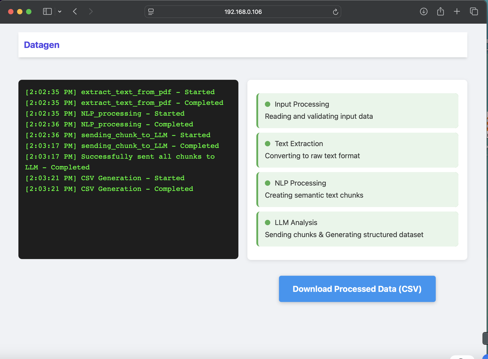
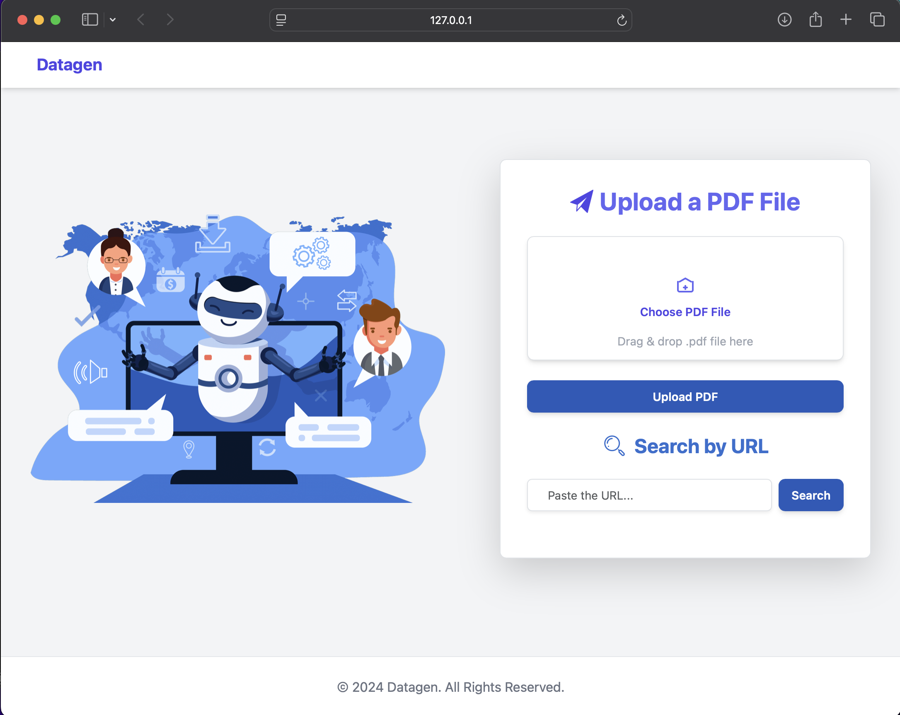

# Datagen: Automated Dataset Generation Tool

## Overview
Datagen is a powerful web application designed to automate the generation of structured datasets in a Q&A format. It processes raw text from various sources, utilizes LLMs to generate contextual question-answer pairs, and outputs well-formatted datasets for AI model fine-tuning and analysis.

## Features
- **Multi-format Input**: Accepts PDFs, DOCs, plain text, and website links via an integrated web crawler.
- **Contextual Text Chunking**: Extracted text is segmented into meaningful chunks based on context.
- **LLM-based Processing**: Chunks are passed to an LLM that generates Q&A pairs.
- **Structured Data Formatting**: Converts Q&A pairs into JSON format before exporting them as CSV.
- **Flexible LLM Integration**: Uses API-based LLMs but also supports locally running models for enhanced privacy and security.
- **Fully Automated Workflow**: Users simply provide input documents or links, and Datagen handles the entire process end-to-end.

## How It Works
1. **Text Extraction**: The tool extracts raw text from various sources like files and websites.
2. **Context-based Chunking**: The extracted text is divided into meaningful segments based on its context.
3. **Q&A Generation**: The segmented text is passed to an LLM, which generates relevant question-answer pairs.
4. **Data Formatting**: The generated Q&A pairs are structured in JSON format.
5. **CSV Export**: The formatted data is converted into a CSV file for easy use in AI model training and analysis.
6. **Local & API-Based LLM Support**: By default, it uses an API-based LLM, but for enhanced security and privacy, it also supports locally running LLMs.

## Interface

### Home Page

### Process Page

The process page shows the entire step-by-step processing, including a log terminal to display errors and process logs. Here, you will also find the "Download CSV" button once the process is completed.

